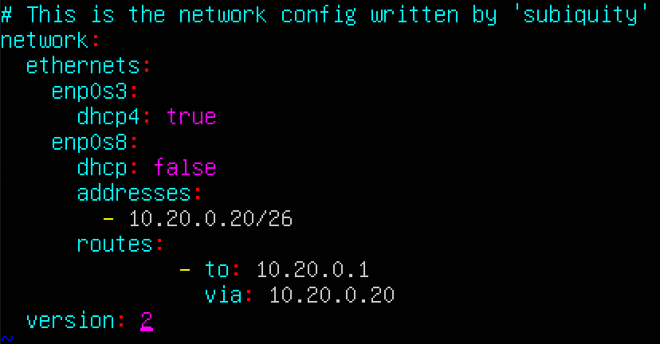
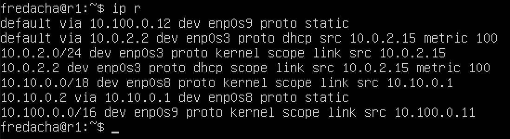
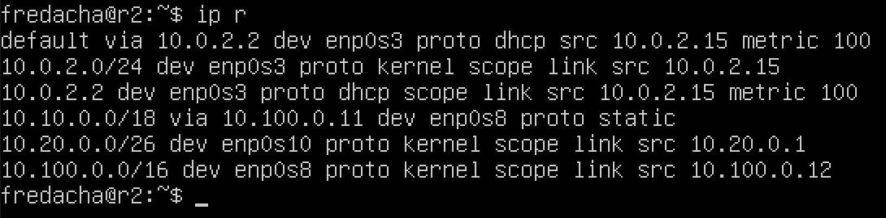

## Instrument ipcalc

### Networks and masks

1. Network address of 192.167.38.54/13

2. Conversion of the mask 255.255.255.0 to prefix and binary,

/15 to normal and binary

11111111.11111111.11111111.11110000 to normal and prefix

3. Minimum and maximum host in 12.167.38.4 network with masks:\
/8

11111111.11111111.00000000.00000000

/4

4.
    `127.0.0.2`, `127.1.0.1` have a loopback channel\
    `194.34.23.100`, `128.0.0.1`  does not have a loopback channel

5.
    `10.0.0.45/8` - private\
    `134.43.0.2/16` - public\
    `192.168.4.2/16` - private\
    `172.20.250.4/12` - private\
    `172.0.2.1/12` - public\
    `192.172.0.1/12` - semi private\
    `172.68.0.2/12` - public\
    `172.16.255.255/12` - private\
    `10.10.10.10/8` - private\
    `192.169.168.1/16`- public

6.
    `10.10.0.2`\
    `10.10.10.10`\
    `10.10.1.255`

## Static routing between two machines
- Existing network interfaces
- ws-1

- ws-2

- network interface corresponding to the internal network is `enp0s8`
- yaml ws-1

- yaml ws-2

- `ip a` after netplan applying
- ws-1

- ws-2

2.1 Adding static route manually

- Adding static route for ws-1

- Adding static route for ws-2

- Pinging ws-1

- Pinging ws-2

2.2 Adding a static route with saving

- Static route via yaml for ws-1

- Statc route via yaml for ws-2

- Pinging ws-1

- Pinging ws-2

## iperf3 utility

- 8 Mbps = 1 MB/s\
100 MBs = 800000 Kbps\
1 Gbps = 1000 Mbps

- Checking connection speed
- ws-1

- ws-2

## Network firewall

- ws-1

- ws-2

- running `chmod +x /etc/firewall.sh` and `/etc/firewall.sh` commands
- ws-1

- ws-2

> The difference in strategies lies in the fact that initially in the ws-1 machine we allow pinging, and then prohibit. In the ws-2 machine everything is exactly the opposite.

4.2 nmap utility

- Can not pinging the machine

## Static network routing

5.1 Configuration addresses

- configuring yaml file for machines
- ws-11

- ws-21

- ws-22

- r1

- r2

- Restarting network services, ip showing and pinging
- r1

- r2

- ws-11

- ws-21

- ws-22

5.2 Enabling IP forwarding

- r1

- r2

5.3. Default route configuration

- Adding gateway and run command `ip r`

- ws-11

- ws-21

- ws-22

- r1

- r2

- Ping r2 router from ws11

5.4 Adding static routes
- r1

- r2

- ws-11

- A path other than 10.10.0.0 is selected in the report because this address points to all addresses.

5.5 List of paths

- r1 dump

- ws-11 traceroute

- The traceroute utility sends udp packets to the specified address. Each packet contains a lifetime variable (ttl), which decreases with each node traversed. The utility will respond with the `ICMP PORT_UNREACHABLE` message if the lifetime ends or the packet reaches the recipient.

5.6 Using ICMP protocol in routing

- ws-11 pinging 10.30.0.11

- r1 icmp filter in tcpdump

## Dynamic IP configuration using DHCP

- r2 dhcp.conf

- r2 resolve.conf

- ws-11 `ip a`

- pinging ws-22 from ws-21

- ws-11 netplan

- r1 dhcp.conf

- r1 resolv.conf

- ws-11 `ip a`

- ws-21 dhcp setup
- ws-21 `ip a` before

- ws-21 `ip a` after

- `dhclient -r` for reset current address
- `dhclient -v` for get new address

## NAT

- changing ports.conf in ws-22

- changing ports.conf in r2

- starting apache on r1

- starting apache on ws-22

- ping ws22 from r1. ws22 should not be pinged

- ping ws22 after adding rule in firewall.sh

- ws-22

- r1

- firewall

- ws-21 local tcp forwarding
- `ssh -L local_port:remote_ip:remote_port user@hostname`

- ws-11 remote tcp forwarding
- `ssh -R remote_port:local_ip:local_port user@hostname`

